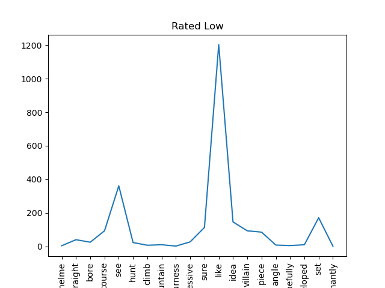

# Exploration of IMDB rating predictors
## <section 1> 

## NLP Analysis of Movie Reviews
**Dataset: [TMDB Movie Reviews](https://drive.google.com/file/d/1vLUzSYleJXqsjNMsq76yTQ5fmNlSHFJI/view?usp=sharing)**
Ratings range from 1 to 10

Comparing Low and High Reviews

High Freq Dist

Low Freq Dist

Top Ngrams
| ('High Rating Reviews', 'Words')   |   ('High Rating Reviews', 'Frequency') | ('Low Rating Reviews', 'Words')   |   ('Low Rating Reviews', 'Frequency') |
|:-----------------------------------|---------------------------------------:|:----------------------------------|--------------------------------------:|
| ('feel', 'like')                   |                            0.000816309 | ('feel', 'like')                  |                           0.00118231  |
| ('good', 'movie')                  |                            0.000730382 | ('final', 'rating')               |                           0.00112938  |
| ('watch', 'movie')                 |                            0.000644454 | ('rating', '★')                   |                           0.00112938  |
| ('good', 'film')                   |                            0.000537045 | ('★', '★')                        |                           0.00103232  |
| ('comic', 'book')                  |                            0.000494082 | ('finished', 'product')           |                           0.000847031 |
| ('action', 'movie')                |                            0.000458279 | ('look', 'like')                  |                           0.000847031 |
| ('movie', 'like')                  |                            0.000458279 | ('appeal', 'poor')                |                           0.000838208 |
| ('special', 'effect')              |                            0.000436797 | ('poor', 'finished')              |                           0.000838208 |
| ('like', 'movie')                  |                            0.000408154 | ('thing', 'appeal')               |                           0.000838208 |
| ('main', 'character')              |                            0.000408154 | ('★', 'thing')                    |                           0.000838208 |
